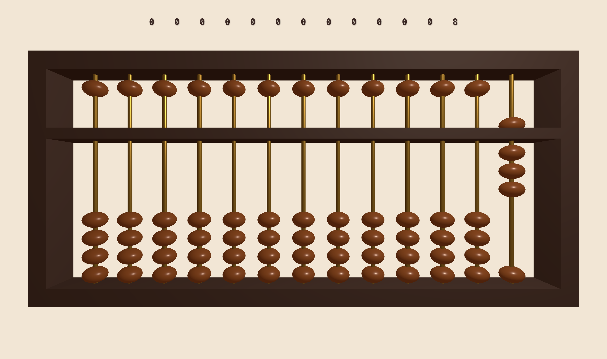

# 3D Soroban Abacus

A browser-based 3D Soroban abacus built with Three.js. It features an interactive, physics-lite simulation where users can manipulate beads to perform calculations. The app uses raycasting for mouse/touch interaction and calculates rod values in real-time to display the corresponding digital output.

<div align="center">
  
</div>

## How It Works

The abacus works on the principle of place value. Starting from the rightmost rod and moving left, the rods represent Units (1s), Tens (10s), Hundreds (100s), and so on.

### Bead Values

- **Heaven Bead (Top)**: Worth 5. It is active when pushed down towards the beam.
- **Earth Beads (Bottom)**: Worth 1 each. They are active when pushed up towards the beam.

### Calculation Logic: The "4 + 7" Example

- **1. the upper beads(heaven beads) just need to be clicked once to move.**
- **2. the bottom beads(earth beads) need to be dragged to make them move.**

Calculating on a Soroban often involves using "Complements" when a rod runs out of space!

1. **Initial State (4)**: We start from the far right rod, its the Unit rod, rod(13), 4 Earth beads are pushed up. The rod value is 4.
2. **The Problem**: We need to add 7. The rod only has the Heaven bead (5) available, which is not enough to add 7 directly.
3. **The Formula**: Since we cannot fit 7, we use the complement of 10. The formula is: +7 = +10 - 3.
4. **The Action**:
   - Subtract 3: On the Units rod, we pull down 3 Earth beads. The rod now shows 1.
   - Add 10: On the Tens rod (the immediate left neighbor), we push up 1 Earth bead, here 1 bead acts as 10. 
5. **Result**: The Tens rod shows 1 (value 10) and the Units rod shows 1 (value 1). The total is 11.

if you still coudn't understand, here is my way - so we got 4 on the the 13th rod, right? now come to its neigbour rod, 12th rod, this rods is the [Tens] rod, here, every bead means a "10", its place value dude! so i will do a trick that instead adding 7 from this 12th rod to the first rod(13) (which doesnt make sense, and cant happen) i will minus 3 from the first rod(13) and add 10 from the second rod(12). then i will see 11 on top of both the rods, that's it! 

## How to Run

Follow these steps to run the project locally.

### Clone the repository:

```bash
git clone https://github.com/NewSmoke38/3d-abacus.git
```

### Navigate to the project directory:

```bash
cd 3d-abacus
```

### Install dependencies:

```bash
npm install
```

### Start the development server:

```bash
npx vite
```

Open your browser and navigate to `http://localhost:5173` (or the port shown in your terminal).

